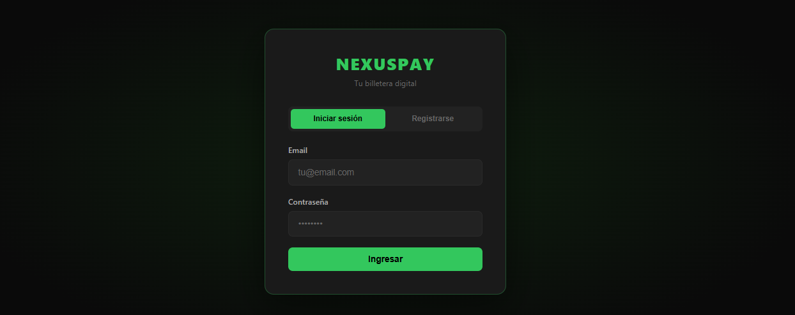
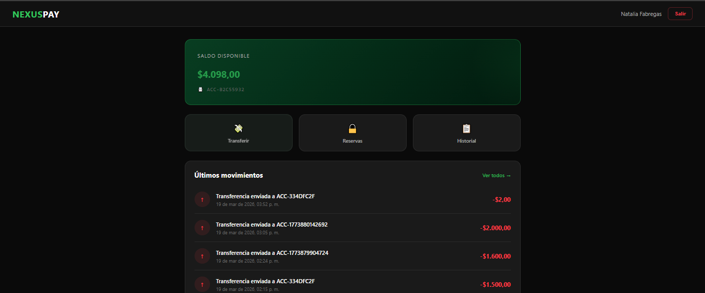
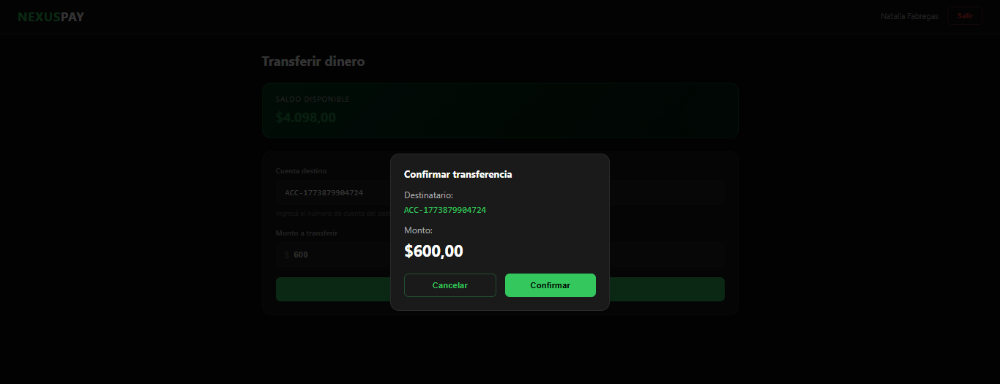
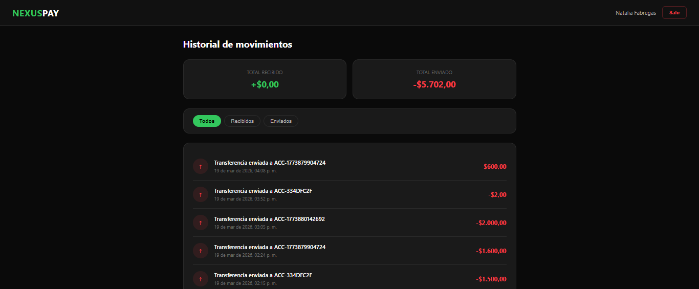

# 💳 NexusPay — Digital Wallet API

A full-stack digital wallet application built with Java Spring Boot and vanilla JavaScript. Simulates core features of a payment platform like Mercado Pago.


---

## ✨ Features

- 📝 User registration and login with BCrypt password encryption
- 💰 Personal account with balance automatically created on registration
- 💸 Money transfers between accounts
- 🔒 Money reservation system (hold, release or cancel funds)
- 📋 Full transaction history with filters
- 🌐 REST API with standardized JSON responses
- ⚠️ Global exception handling with custom exceptions

---

## 🛠️ Tech Stack

### Backend
| Technology | Version | Purpose |
|---|---|---|
| Java | 17 | Programming language |
| Spring Boot | 3.5 | Application framework |
| Spring Data JPA | - | Database ORM |
| Spring Security Crypto | - | BCrypt password hashing |
| MySQL | 8.0 | Relational database |
| Lombok | - | Boilerplate reduction |
| Maven | - | Dependency management |

### Frontend
| Technology | Purpose |
|---|---|
| HTML5 | Page structure |
| CSS3 | Custom styling |
| JavaScript ES6 | Logic and API calls |
| Bootstrap (via CSS variables) | Layout base |

---

## 📁 Project Structure
```
nexus-pay-wallet/
├── src/
│   └── main/
│       ├── java/com/nexuspay/wallet/
│       │   ├── controller/
│       │   │   ├── AuthController.java
│       │   │   ├── WalletController.java
│       │   │   └── ReservationController.java
│       │   ├── service/
│       │   │   ├── AuthService.java
│       │   │   ├── WalletService.java
│       │   │   └── ReservationService.java
│       │   ├── repository/
│       │   │   ├── UserRepository.java
│       │   │   ├── AccountRepository.java
│       │   │   ├── TransactionRepository.java
│       │   │   └── ReservationRepository.java
│       │   ├── entity/
│       │   │   ├── User.java
│       │   │   ├── Account.java
│       │   │   ├── Transaction.java
│       │   │   ├── TransactionType.java
│       │   │   ├── Reservation.java
│       │   │   └── ReservationStatus.java
│       │   ├── dto/
│       │   │   ├── UserDTO.java
│       │   │   ├── UserResponseDTO.java
│       │   │   ├── LoginDTO.java
│       │   │   ├── TransferRequestDTO.java
│       │   │   ├── ReservationRequestDTO.java
│       │   │   └── ErrorResponseDTO.java
│       │   ├── exception/
│       │   │   ├── GlobalExceptionHandler.java
│       │   │   ├── UserNotFoundException.java
│       │   │   ├── EmailAlreadyExistsException.java
│       │   │   ├── InsufficientFundsException.java
│       │   │   └── ReservationNotFoundException.java
│       │   ├── CorsConfig.java
│       │   └── WalletApiApplication.java
│       └── resources/
│           └── application.properties
├── frontend/
│   ├── css/
│   │   └── styles.css
│   ├── js/
│   │   ├── index.js
│   │   ├── dashboard.js
│   │   ├── transfer.js
│   │   ├── reservations.js
│   │   └── history.js
│   ├── index.html
│   ├── dashboard.html
│   ├── transfer.html
│   ├── reservations.html
│   └── history.html
└── pom.xml
```

---

## ⚙️ Setup & Installation

### Prerequisites
- Java 17+
- Maven
- MySQL 8.0+
- Any modern browser

### 1. Clone the repository
```bash
git clone https://github.com/tomasgarcia39/nexus-pay-wallet.git
cd nexus-pay-wallet
```

### 2. Configure the database
Open `src/main/resources/application.properties` and update your MySQL credentials:
```properties
spring.datasource.url=jdbc:mysql://localhost:3306/nexus_pay_db?createDatabaseIfNotExist=true
spring.datasource.username=your_username
spring.datasource.password=your_password
```

### 3. Run the backend
```bash
./mvnw spring-boot:run
```
The API will start on `http://localhost:8081`

> The database tables are created automatically by Hibernate on first run.

### 4. Run the frontend
Open the `frontend/` folder in VS Code and use **Live Server** to open `index.html`.

Or simply open `frontend/index.html` directly in your browser.

---

## 🔌 API Endpoints

### Auth
| Method | Endpoint | Description |
|---|---|---|
| POST | `/api/auth/register` | Register a new user |
| POST | `/api/auth/login` | Login |

### Wallet
| Method | Endpoint | Description |
|---|---|---|
| GET | `/api/wallet/{userId}/balance` | Get account balance |
| POST | `/api/wallet/transfer` | Transfer money |
| GET | `/api/wallet/{userId}/transactions` | Get transaction history |

### Reservations
| Method | Endpoint | Description |
|---|---|---|
| POST | `/api/reservations` | Create a reservation |
| PUT | `/api/reservations/{id}/confirm` | Release reserved funds |
| PUT | `/api/reservations/{id}/cancel` | Cancel a reservation |
| GET | `/api/reservations/user/{userId}` | Get user reservations |

---

## 💡 Key Concepts

**Balance vs Available Balance**
The wallet distinguishes between total balance and available balance. When a reservation is created, funds are held (`reservedBalance`) and deducted from the available amount — but not from the total balance until the reservation is confirmed or cancelled.

**Transaction History**
Every transfer generates two transaction records: a `DEBIT` on the sender's account and a `CREDIT` on the receiver's account.

**Global Exception Handling**
All errors return a standardized JSON response:
```json
{
    "status": 404,
    "message": "Usuario no encontrado con email: test@gmail.com",
    "timestamp": "2026-03-19T14:27:25.333"
}
```

---

## 📸 Screenshots






---

## 👨‍💻 Author

**Tomas Garcia**  
[GitHub](https://github.com/tomasgarcia39) · [LinkedIn](https://linkedin.com/in/tomas-garcia-b37364301)

---

## 📄 License

This project is open source and available under the [MIT License](LICENSE).
```
